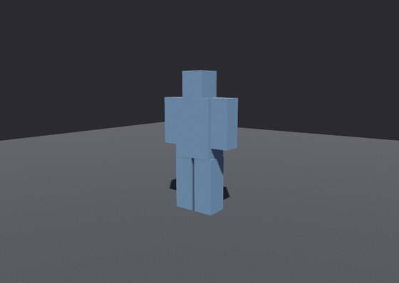

# bevy_autogib

> ⚠️ **Vibe Coded** — written by an AI agent working from a human's direction. It is used in a shipping game and covered by tests, but it has had no line-by-line human audit. Read it before you trust it.

**Runtime mesh fracture for Bevy.** Take whatever meshes an entity actually loaded, cut them into watertight-capped chunks, bake that once per source asset, and take pieces off it when something hits it.



That is `examples/explode.rs` at its own 0.4× playback. The subject is intact, then it *is* its own fragments — the "break" is one despawn and a spawn, because the fracture was computed long before. **The red is not a colour choice, it is the whole idea:** every fragment comes back as two meshes, the subject's own surface and the faces this cut just created, so the inside can take a different material. Render both with the skin material and the same fragments stop looking broken and start looking disassembled.

> **This repo is the source of truth.** It owns the crate; changes are made here and nowhere else. [`Ladvien/foundation_vs_slop`](https://github.com/Ladvien/foundation_vs_slop) consumes it as a git dependency pinned to a rev, the same way any other consumer would. It was the other way round — a read-only `git subtree split` mirror — until recently, and that inversion is a known stale-read hazard: a `subtree split` carries only *commits*, so anything living uncommitted in the monorepo working tree could never arrive by that route. If you find a `crates/bevy_autogib/` in a monorepo checkout, it is a corpse.

## Features

- **One bake, every granularity.** A bake keeps the whole hierarchy it cut through, so the same cached asset answers "break this into three" and "break this into forty" without cutting twice.
- **Localised damage.** A bond graph records which fragments actually share a face. Shoot a shoulder and the arm comes off while the body stays standing — the joints are found by geometry, not authored.
- **Five region queries** — projectile, slash, swept blade, blast, directional pull — each a pure function of the bake plus some geometry.
- **Progressive destruction.** Hit it again and it comes apart further. Island detection is stateless; you own the damage state.
- **Two meshes per fragment** — the subject's own skin and the newly-cut faces, separately, so the inside can take a different material.
- **Solver-ready colliders.** Every fragment is one convex cell. `Collider::convex_hull(frag.cell.points())` and you are done — no decomposition at spawn, no trimesh.
- **Shape and look dials** — off-centre cuts, size spread, weak-axis bias, crumpled cut faces, rounding — so the output reads as torn rather than as shattered ice.
- **Reproducible.** Two runs of the same build on the same asset produce bit-identical fragments, and a test enforces it.
- **No physics dependency, no RNG dependency, no game logic.** `bevy`, optional `serde`, and `isomesh` for validation.

## Install

Not on crates.io (`publish = false`). Depend on it by git, pinned to a rev:

```toml
[dependencies]
bevy_autogib = { git = "https://github.com/Ladvien/bevy_autogib", rev = "..." }
```

Requires **Bevy 0.19** and a Rust toolchain with **edition 2024**.

| feature | default | what it does |
|---|---|---|
| `serde` | ✅ | `Serialize`/`Deserialize` on the settings and hierarchy types, so a game can author dials in RON |
| `strict-order` | — | Turns on the vertex-soup sort's runtime tie check in release. On automatically under `debug_assertions`; this is for a harness that builds in release and still wants it |

## Quick start

Mark what should break, then read the bake back when it dies. The launch is yours, and so is the solver.

```rust
use bevy::prelude::*;
use bevy_autogib::{AutogibPlugin, AutogibSystems, DetachedPart, FractureCache, FractureSubject};

#[derive(States, Debug, Clone, PartialEq, Eq, Hash, Default)]
enum GameState { #[default] Playing, Paused }

fn wire(app: &mut App) {
    app.add_plugins(AutogibPlugin)
        // The crate configures no run condition — when the bake runs is yours.
        .configure_sets(Update, AutogibSystems.run_if(in_state(GameState::Playing)));
}

// Mark what should break, and what should come off intact.
fn spawn_enemy(mut commands: Commands, assets: Res<AssetServer>) {
    let scene: Handle<WorldAsset> = assets.load("enemy.glb#Scene0");
    let enemy = commands.spawn((FractureSubject(scene.clone()), WorldAssetRoot(scene))).id();
    // ...once the scene streams in, tag whatever should detach intact:
    commands.entity(enemy).insert(DetachedPart);
}

// At the moment of death, read the bake at whatever granularity this death deserves.
fn on_death(cache: Res<FractureCache>, subject: &FractureSubject) {
    for frag in cache.leaves(subject.0.id()) {          // finest
        let _ = (&frag.outer_mesh, &frag.cap_mesh, frag.center_local, frag.half_extents);
    }
    for frag in cache.frontier_of(subject.0.id(), 3) {  // the same bake, as three big chunks
        let _ = frag.id;
    }
}
```

You do not need an `App` to use the fracture itself. `fracture_mesh` is the whole pipeline with no assets and no ECS — meshes in, meshes out:

```rust
use bevy::math::{Mat4, Vec3, primitives::Cuboid};
use bevy::mesh::Mesh;
use bevy_autogib::{CutSettings, ProxyCell, fracture_mesh};

let body = Mesh::from(Cuboid::new(1.0, 2.0, 1.0));

// **The proxy is yours.** This crate cuts a convex decomposition and carries your triangles along
// as a payload — it never cuts the triangle soup. One cell per connected shell; a consumer already
// running V-HACD or CoACD for colliders has these, and a blocked-out subject can use `from_box`.
let proxy = vec![ProxyCell::from_box(Vec3::ZERO, Vec3::new(0.5, 1.0, 0.5))];

let cut = CutSettings::new(
    12,          // finest fragment count
    0.15,        // stop cutting below this fraction of the subject's size
    0xC0FFEE,    // seed — same seed, same pieces, every run
);
let baked = fracture_mesh(&[(&body, Mat4::IDENTITY)], &proxy, &cut);

assert_eq!(baked.frontier_of(3).len(), 3);   // one bake, read back as three pieces
let pieces = baked.leaves();                 // ...or as all of them
assert!(pieces.len() > 1);
assert!(pieces.iter().all(|p| p.outer.is_some() || p.cap.is_some()));
```

## Demos

**[docs/DEMOS.md](docs/DEMOS.md) — all four examples, with recordings**, what each is for, and how to regenerate the clips.


That is `examples/sever.rs`, on a fixed script. The subject **stays standing** between blows and what comes off depends on where you hit it. Run it and you aim it yourself:

```sh
cargo run --release --example sever           # needs a GPU
cargo run --release --example explode         # needs a GPU
cargo run --release --example fracture_cube   # terminal only — no window, no GPU
```

```text
  arrows / WASD   move the aim marker
  1 … 5           projectile · slash · swept blade · blast · pull
  G               granularity — cycle which frontier of the bake is standing
  T               soften — cycle how hard the drawn fragments are rounded
  R               reset
```

## Why: break the asset once, not the frame

The tempting version of this feature computes a fracture at the moment of impact. The shipped version, in more or less every game that has one, does not — it **pre-fractures the asset and swaps it in at runtime**, which is exactly what Müller, Chentanez & Kim document as the practical norm (ACM TOG 2013). Sellán et al.'s *Breaking Good* (ACM TOG 2022) is the most physically honest option available, and its fragments are precomputed **offline** through tetrahedralization and a conic solve in a Python/libigl toolchain — not something a minimal-dependency Rust crate can embed.

**But a static pre-fracture cannot answer where it was hit**, and Müller says so plainly: *"When a gamer shoots at a glass window, she expects the spider-web-shaped fracture pattern to be centered around the location where the bullet hit the glass. Anything else clearly destroys the illusion."* So the bake is not a fragment *set*. It is a hierarchy plus an adjacency graph, and every blow is a query against it. That is the shape PhysX Blast and Unreal's Chaos arrived at independently.

**The cut runs on a convex proxy, never on the triangle soup.** Müller's load-bearing observation is that `plane ∩ convex polyhedron = convex polygon`, which makes every cut face convex by construction and a centroid fan over it provably valid. There is no boundary-loop recovery in this crate because there is no input that needs one. The render triangles ride along as a payload, assigned to whichever cell bounds them and split only where they straddle a plane.

The cost of that choice is the proxy itself: **you supply it.** See "What it deliberately does not do".

## The API

### Baking, in the ECS

| item | kind | what it is for |
|---|---|---|
| `AutogibPlugin` | `Plugin` | Registers the cache, the settings, and the bake |
| `AutogibSystems` | `SystemSet` | On `Update`. Gate and order against this, not the system |
| `FractureSubject(Handle<WorldAsset>)` | `Component` | What to break. The cache key *and* the seed source |
| `FractureProxy(Vec<ProxyCell>)` | `Component` | Your convex decomposition, subject-local. Required |
| `DetachedPart` | `Component` | A subtree pruned out and baked as one intact chunk — a carried weapon, a hat |
| `FractureSettings` | `Resource` | Eleven bake dials. `init_resource`d, so yours wins if inserted first |
| `bake_fractures` | fn | The system itself, public only so it can be named in an ordering constraint |

### Reading a bake back

| item | what it is for |
|---|---|
| `FractureCache::leaves(source)` | The finest granularity — every fragment that was never cut further |
| `FractureCache::frontier_of(source, n)` | The same bake as roughly `n` pieces. **The granularity dial** |
| `FractureCache::at_depth(source, d)` | Every branch cut to the same level |
| `FractureCache::tree(source)` | The hierarchy itself: `FragmentTree`, `TreeNode`, `FragmentId` |
| `FractureCache::bonds(source)` | The `BondGraph` for the finest frontier |
| `FractureCache::detached_chunk(source)` / `is_baked(source)` | The pruned part; whether the bake has happened |
| `Fragment` | `id`, two mesh handles, the convex `cell`, `center_local`, `half_extents` |

### Where the blow landed

Each query returns a `Reach` — a severity in `[0, 1]` per bond — and **you** pick the threshold at which one gives way.

| item | models |
|---|---|
| `spread(graph, at, min, max)` | a projectile — nearest fragment, then outward **along the bonds** |
| `capsule(graph, a, b, min, max)` | a swung edge — falloff from the segment a blade travelled |
| `swept_triangle(graph, a, b, c)` | a swept blade — every bond the swing passed *through*, no falloff |
| `radial(graph, at, min, max)` | a blast — falloff from a point in open space |
| `directional(graph, at, dir, min, max)` | a pull — weighted by how squarely each face meets it |
| `Reach::above(threshold)` | the bonds that give way. Scale severity by material first if you like |
| `BondSet` | your accumulated damage. `sever_all`, `is_broken`, `severed` |
| `BondGraph::islands(members, broken)` | what is still connected. Stateless — call it after every blow |
| `BondGraph::of(members, capacity)` | build a graph for a frontier other than the finest |

### Geometry, with no ECS

| item | what it is for |
|---|---|
| `fracture_mesh(parts, proxy, &CutSettings)` | The whole pipeline. Meshes in, `Fracture` out |
| `Fracture` | `fragments` + `tree` + `bonds`, with `leaves()`, `frontier_of()`, `at_depth()` |
| `CutSettings` | The geometry dials for one bake, without the ECS sizing policy |
| `ProxyCell` | One convex cell. `from_box`, `points()` (→ your collider), `volume()` (→ mass) |
| `audit_proxy` / `audit_render` / `SolidAudit` / `SurfaceReport` | Measure what the fracture produced |
| `hash_f32` | The frozen integer hash the fracture seeds from |

### The dials

`FractureSettings` sizes the bake per asset; `CutSettings` is what a single cut actually needs.

| dial | default | effect |
|---|---|---|
| `pieces_base` / `ref_extent` / `min_pieces` / `max_pieces` | 14 / 0.5 / 6 / 40 | Fragment count, scaled by the mesh's own size |
| `min_fraction` | 0.18 | Stop cutting a piece below this fraction of the subject's size |
| `max_depth` | 12 | Cuts from a proxy cell to the finest fragment — the hierarchy's memory bound |
| `plane_jitter` | 0.35 | How far a cut plane slides off centre. `0.0` halves every piece and reads as uniform shards |
| `size_spread` | 0.5 | How much the largest-first cut order may be nudged, widening the size distribution |
| `weak_axis` | 0.75 | How hard to cut across a piece's *narrow* dimension — where a real thing comes apart |
| `cap_relief` | 0.30 | How much the drawn cut face is crumpled |
| `soften` | 0.5 | How much the drawn fragment is rounded. **Tier B only** — the collider never changes |

The last four are look dials, and the last two touch only the *drawn* mesh: the proxy cell stays exactly planar and convex, so colliders and every watertightness guarantee are untouched. `fracture_cube` prints the proof — cell volume identical at every `soften`, drawn area falling away.

## What it deliberately does not do

**It does not compute a convex decomposition.** You supply the proxy cells; the crate cuts them. A consumer already running V-HACD or CoACD for colliders has a decomposition, and forcing a second, different one would be the fracture disagreeing with the physics about what the object is. `ProxyCell::from_box` covers a blocked-out subject.

**It does not move anything.** No rigid bodies, no velocities, no physics dependency. The bake hands you a mesh and a convex cell per piece; spawning them, building a collider and throwing them is your game's decision and your solver's job. `examples/explode.rs` integrates its own ballistics in thirty lines to make the point.

**It does not know what died.** No health, no factions, no damage types. It hands back a *reach* — geometry — and your game decides what an area is worth and what threshold means "this gives way".

**It does not own your schedule.** The plugin adds one system to `Update` in one public set. Whether that runs while a menu is open is yours to configure.

**It does not bond cells that merely touch.** Two cells are neighbours only when they share a *coplanar* face. V-HACD and CoACD produce cells that abut without their boundary polygons agreeing, so each root's subtree comes out as its own island unless your decomposition shares faces. Closing that with a proximity heuristic would silently weld a head to a torso.

**It fractures the bind pose.** Geometry is read from `Mesh3d` as authored, so a skinned character breaks from its rest pose, not its death pose. A death-pose snapshot is the proper upgrade; per the fracture literature the gap is not visible when the chunks are flung fast.

## Determinism

Two runs of the same build, on the same asset, must produce bit-identical fragments. Two things make that true, and both were learned the hard way:

**The seed comes from the asset PATH, never its `AssetId`.** An `AssetId` is a slot index in the asset arena, handed out by async load order — so the same file gets a different id run to run, hashes to a different seed, and the mesh is partitioned along completely different planes. Measured, before the fix: 23 of 23 fragments differed, in half-extents as well as centres.

**The vertex soup is assembled in a canonical order.** `Children` order for a glTF scene is whatever order async instantiation happened to add nodes in. Fragment centroids are float sums over the merged soup, float addition is not associative, and so an unsorted soup moves every centroid by a few ULPs — same fragment count, positions off in the last bits. Sub-meshes are sorted by `(mesh asset path, world-matrix bits)` before a single vertex is appended, and the key is checked at runtime for uniqueness under `debug_assertions` or `strict-order`.

`hash_f32` is a hand-rolled integer hash with its output frozen in a test, for the same reason: there is no RNG dependency here, because a stream that may change between minor versions cannot underwrite any of the above.

Note what this does *not* claim. Fragment geometry is `f32` arithmetic, so cross-architecture bit-identity is not promised — only same-build, same-machine reproducibility, which is what a replay or a regression golden actually needs.

## Status

**0.1.0, pre-release, and not published to crates.io.** It is used in one shipping game, which consumes it by rev.

| area | state |
|---|---|
| Cutting, capping, colliders | Stable. Every fragment audits as a closed convex solid, swept across seeds and shape dials |
| Hierarchy, bond graph, region queries | Landed and tested; the API may still move before 0.2 |
| Look dials (`plane_jitter`, `size_spread`, `weak_axis`, `cap_relief`, `soften`) | Newest surface here. Defaults are tuned by eye on a blockout, not measured against real assets |
| Skinned meshes | Bind pose only — see above |
| Cross-architecture reproducibility | Not claimed |

The API is **not** stable before 0.2. Pin a rev.

Known limitations are listed under "What it deliberately does not do" rather than hidden; `BACKLOG.md` carries the reasoning behind each decision, including the predictions that turned out wrong.

## Contributing

Issues and PRs here, on this repo — it is the source of truth, not a mirror.

Before opening a PR:

```sh
cargo test                  # unit + tests/leaf.rs + doctests
cargo build --release       # NOT redundant with `cargo test` — see below
cargo build --examples
cargo clippy --all-targets  # three warnings pre-exist; add none
```

**`cargo build --release` is load-bearing.** `cargo test` compiles dev-dependencies, and the dev-dependency here is the *full* `bevy` umbrella. Cargo unifies features, so under `cargo test` this crate silently gets every `bevy` feature there is and a missing entry in its own `[dependencies]` cannot fail. That is not hypothetical — `WorldAsset` was reached for while only `bevy_scene` was declared, and every test passed on a crate that did not build.

Two house rules worth knowing before you write code:

- **One path per feature.** No fallbacks, no legacy shims, no stub placeholders. Where the primary path cannot produce a usable result, it fails loudly. `seed_from_path` refusing to bake an unpathed handle *is* the rule.
- **This crate never learns what died.** No health, no factions, no damage, no physics. `tests/leaf.rs` enforces the dependency half of that; the naming half is on you.

Anything that changes emitted geometry regenerates the clips in `docs/` — see [docs/DEMOS.md](docs/DEMOS.md#regenerating-these).

## References

- Müller, Chentanez & Kim, "Real-Time Dynamic Fracture with Volumetric Approximate Convex Decompositions", ACM TOG 32(4), 2013. DOI [10.1145/2461912.2461934](https://doi.org/10.1145/2461912.2461934)
- Sellán, Luong, Mattos Da Silva, Ramakrishnan, Yang & Jacobson, "Breaking Good: Fracture Modes for Realtime Destruction", ACM TOG 41(4), 2022. DOI [10.1145/3549540](https://doi.org/10.1145/3549540)
- Huang & Kanai, "DeepFracture: A Generative Approach for Predicting Brittle Fractures", 2023. arXiv [2310.13344](https://arxiv.org/abs/2310.13344) — Mott's fragment-size distribution
- Schvartzman & Otaduy, "Fracture Animation Based on High-Dimensional Voronoi Diagrams", I3D 2014.
- Sutherland & Hodgman, "Reentrant Polygon Clipping", CACM 17(1), 1974.
- [NVIDIA Blast](https://nvidia-omniverse.github.io/PhysX/blast/) — the chunk-hierarchy / support-graph / damage-shader vocabulary this crate's runtime half borrows.

## License

MIT OR Apache-2.0, at your option.
