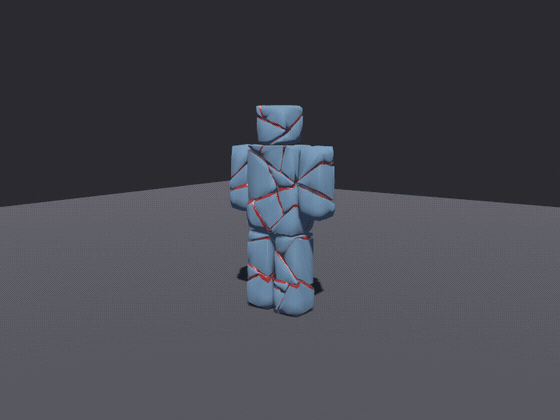
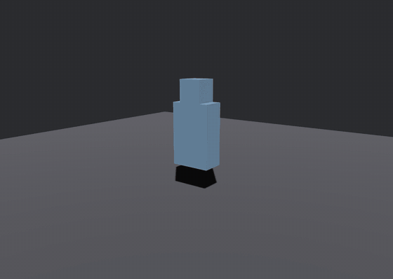
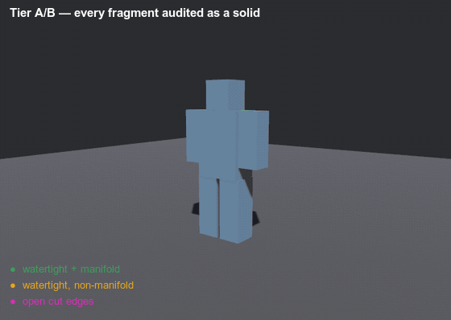

# Demos

Every example in the repo, and what each one is for. All four run from a clean checkout with no
assets and no setup:

```sh
cargo run --release --example fracture_cube   # terminal only — no window, no GPU
cargo run --release --example sever           # needs a GPU
cargo run --release --example explode         # needs a GPU
```

The clips below are **not screen recordings**. They come from two headless recorders, `capture` and
`capture_sever`, which render the same scenes on a fixed timestep with no window and no wall clock.
Frame 62 of one run is frame 62 of the next, so two GIFs taken either side of a change differ only
where the geometry does — which is what makes them worth committing. Regenerating them is
[at the bottom](#regenerating-these).

**The subject is a blocked-out humanoid** — torso, head, two arms, two legs, one convex proxy cell
each. That matters more than it looks. Cutting a limbless mass with pseudorandom planes produces
wedges sliced diagonally out of a blob, which reads as a frozen statue shattering however good the
fracture is, because none of the pieces is a *part of a body*. Nothing tuned in the cutter fixes
that; the subject had no anatomy to break along.

---

## `sever` — it comes apart where you hit it



The subject stays standing and you take pieces off it. One bake, cached at startup; every blow is a
region query against it plus a threshold, and whatever stops being connected falls off.

The clip is scripted. Run it yourself and you aim:

```text
  arrows / WASD   move the aim marker
  1               a projectile   — nearest fragment, then outward along the bonds
  2               a slash        — falloff from the segment a blade travelled
  3               a swept blade  — every bond the swing passed through, no falloff
  4               a blast        — falloff from a point in open space
  5               a pull         — weighted by how squarely each face meets it
  G               granularity — cycle which frontier of the bake is standing (6 / 12 / 20 / 34)
  T               soften — cycle how hard the drawn fragments are rounded (0 / 0.25 / 0.5 / 0.75)
  R               reset
```

The window carries that legend on screen, and a status line at the bottom reporting what the last
blow did plus the state of both dials — **because without it the feature set is invisible.** Watching
someone use an earlier build: they pressed the number keys, never found the aim marker or `G` or `T`,
and concluded it had broken when the subject ran out of pieces to lose. A blow that severs nothing
new is a legitimate outcome and now says so.

**`T` is the one to press first.** At `0.0` the fragments keep the hard dihedral edges a plane cut
leaves behind, and that is the visual language of ice and cleaved stone however good the fracture
underneath is. One press and the same cuts read as torn.

`G` re-reads the bake it already has; `T` has to cut again, because the rounding is built into the
drawn mesh rather than applied by a shader.

What the run above actually does, from its own log:

| blow | bonds reached | gave way | fragments off |
|---|---|---|---|
| projectile, left shoulder | 59 | 16 | 2 |
| projectile, head | 29 | 11 | 4 |
| slash, right shoulder | 76 | 53 | 7 |
| swept blade, waist | 6 | 6 | **11** |
| blast, chest | 103 | 91 | 9 |

Two rows are worth reading twice. The **swept blade** reached only 6 bonds and took 11 fragments off
— those 6 are the hips, and what left was both legs. And the second **projectile** reaches 29 bonds
while severing 11: a hit that reaches a lot and detaches little is a fragment still held on by the
bonds the region missed, which is what makes repeated damage read as wearing a thing down rather than
as a switch.

### The joints were never authored

A joint is two body parts meeting over a shared surface, and that is exactly what the bond graph
looks for — coplanar faces, opposite normals, positive overlap. Laid out as one cell per part, the
graph comes back with one bond per joint, its area the joint's own cross-section:

```text
torso <-> head    area 0.0676   the neck
torso <-> arm.L   area 0.1040   the shoulder
torso <-> leg.L   area 0.0528   the hip
```

So a hit on the shoulder takes off the arm, at every granularity, with no code that knows what an arm
is. Read the bake at 6 pieces and the pieces *are* the body parts; read it at 34 and they are gibs.

**None of the decisions in that table are the crate's.** `bevy_autogib` hands back a *reach* — a
severity in `[0,1]` per bond — and `examples/common/body.rs` picks the threshold at which one gives
way, decides which island is still "the body", and throws the rest. A game scales that severity by
material and by how much damage the blow carried; the crate has neither fact.

---

## `explode` — prefracture, then one despawn and a spawn



The other half, and the shape a death actually wants: the subject is intact, then it *is* its own
fragments. The break is one despawn and a spawn, because the fracture was computed long before.

**The red is not a colour choice, it is the whole idea.** Every fragment comes back as two meshes —
the subject's own surface and the faces this cut just created — so the inside can take a different
material. Render both with the skin material and the same fragments stop looking broken and start
looking disassembled.

Press **Space** to break it early, or to break it again with a new seed.

Note the motion: launch speed scales with fragment mass, so light chips leave fast and heavy chunks
barely move and flop. Throwing every piece at one speed leaves a severed limb and a splinter at
identical velocity, which reads as an explosion in a quarry rather than as something coming apart.

---

## `capture` — the same burst, coloured by what the audit says



`explode` is the one you watch; this is the one you *measure*. Same subject, same motion, but each
fragment is tinted by [`audit_proxy`](../src/audit.rs)'s verdict on it:

| colour | meaning |
|---|---|
| green | watertight **and** manifold — a closed solid, the thing we want |
| amber | watertight but not manifold — closed, yet not a surface a solver can trust |
| magenta | open cut edges — a cap that never closed, so this piece is not a solid at all |

All 18 come back green, and under Tier A they must: a plane through a convex cell yields two convex
cells, and there is no input for which that can fail. Magenta here would mean the cell clipper is
wrong, not that the subject was awkward.

This clip is rendered at `soften = 0.25` deliberately. The rounding is Tier B — it touches only the
drawn mesh — so a clip that is *about* the solid's audit verdict should show that the verdict does
not move when the look does. It is still 18 of 18 green.

The verdict is taken on the **proxy cell** — the artefact that is a solid — never on the render skin,
which is a surface subset and open by construction. Colouring by the skin's watertightness paints
almost everything magenta and says nothing.

For contrast, `fracture-baseline.gif` in this directory is the *before* picture, from the soup cutter
that predated the Tier A/B split.

---

## `fracture_cube` — the numbers, in a terminal

No window, no GPU, no `App`. A GIF of it would be a still image of text, so here is the text — it is
the fastest way to see what a settings change does. It keeps the older torso-and-head fixture on
purpose: it is the smallest subject that is still honestly non-manifold where two shells meet.

```text
  granularity — one bake, read back at each piece count:
      2 asked →   2 pieces, total volume 0.2493
      3 asked →   3 pieces, total volume 0.2493
      5 asked →   5 pieces, total volume 0.2493
      8 asked →   8 pieces, total volume 0.2493
     12 asked →  12 pieces, total volume 0.2493

  soften — rounding the drawn surface (Tier B only)
    value     drawn tris   drawn area   cell volume
     0.00            921        7.073        0.2493
     0.25           3688        6.233        0.2493
     0.50           3688        5.597        0.2493
     0.75           3688        5.105        0.2493

  adjacency — 31 bonds over 12 finest fragments
    intact, that is 1 island(s)
    severing fragment 21's 2 bond(s) leaves 2 island(s) of sizes [11, 1]

   THE SOLID — each fragment's convex proxy cell, every face, closed
  ─────────────────────────────────────────────────────────────────────────────────
   watertight (no boundary edges)       12 of 12
   manifold                             12 of 12
   topological sphere (χ = 2)           12 of 12
   solid enough for a mesh collider     12 of 12
   volume enclosed                      0.2493
  ─────────────────────────────────────────────────────────────────────────────────

  re-fracturing with the same seed gave 12 pieces — bit-identical: true
```

Four things in there are worth reading twice.

**Every granularity conserves the same volume.** `2 asked` and `12 asked` are two frontiers of one
bake, not two bakes, and both tile the subject exactly once.

**`soften` costs nothing in collision fidelity, and the table proves it.** Rounding is applied to the
mesh you draw, never to the convex cell you hand a solver, so the cell volume is identical at every
strength while the drawn area falls away. The drawn mesh ends up slightly *inside* its own collider,
which is the harmless direction — a gib rendering proud of its hull would poke through a floor it is
resting on; one rendering inside it never can. The triangle count quadruples once and then stops,
because the subdivision happens at any non-zero strength and the dial only changes how far the
relaxation travels.

**The two audit blocks are different questions and must never be added together.** A fragment is a
closed convex *cell* and a *subset of the subject's own surface*. The first is a solid, and 12 of 12
come back closed. The second has a boundary because a subset of a surface has a boundary — those open
edges are where the skin ends and the cut begins, which is what makes it a subset. Tracked, never
asserted to zero.

**The volume bar in the fragment table is the size distribution.** It used to be keyed on the longest
axis, which read every slab as large and hid the thing `plane_jitter` and `size_spread` exist to
change.

---

## Regenerating these

Any change that moves emitted geometry should regenerate them, or the picture stops describing the
code. Both recorders write one PNG per frame; `tools/gif.sh` does the encode, with a fixed two-pass
palette so two GIFs a week apart are actually comparable.

```sh
cargo run --release --example capture       -- --out frames-demo  --tint demo  --width 720 --height 512 --soften 0.5
cargo run --release --example capture       -- --out frames-audit --tint audit --width 720 --height 512 --soften 0.25
cargo run --release --example capture_sever -- --out frames-sever

WIDTH=560 LEGEND=none  tools/gif.sh frames-demo  docs/explode.gif ""
WIDTH=560 LEGEND=audit tools/gif.sh frames-audit docs/fracture-tier-ab.gif "Tier A/B — every fragment audited as a solid"
WIDTH=560 LEGEND=none  tools/gif.sh frames-sever docs/sever.gif ""
```

`LEGEND=none` omits the green/amber/magenta key, which belongs only on the audit-tinted clip: a key
naming colours that are not in the picture is worse than no key at all. `--width`/`--height` set the
render aspect — `720x512` matches the 560×398 the clips are encoded at, so the crop is not itself one
of the differences when you hold two of them up next to each other.

The two recorders share `examples/common/` — the headless harness, and the subject and damage rules
`sever` itself uses. That sharing is deliberate: a recorder that reimplements its subject drifts from
it silently, and the drift would be invisible in exactly the place you would look for it.
