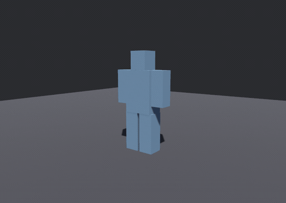
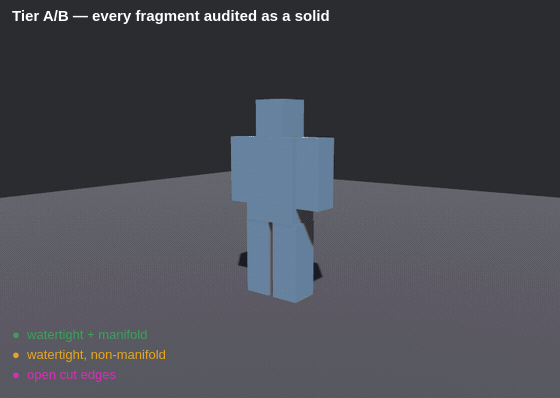

# Demos

Every example in the repo, and what each one is for. All seven run from a clean checkout with no
assets and no setup:

```sh
cargo run --release --example fracture_cube   # terminal only — no window, no GPU
cargo run --release --example sever           # needs a GPU
cargo run --release --example explode         # needs a GPU
cargo run --release --example bullet_holes    # needs a GPU
cargo run --release --example carnage         # needs a GPU
cargo run --release --example ribbons         # needs a GPU
cargo run --release --example pooling         # needs a GPU
```

The clips below are **not screen recordings**. They come from headless recorders — `capture`,
`capture_sever`, `capture_holes`, `capture_carnage`, and now `capture_ribbons` and `capture_pooling` —
which render the same scenes on a fixed timestep with no window and no wall clock. Frame 62 of one run
is frame 62 of the next, so two GIFs taken either side of a change differ only where the geometry does
— which is what makes them worth committing. `capture_carnage` and `capture_pooling` go further and
print a digest two runs must agree on. Regenerating them is [at the bottom](#regenerating-these).

**The subject is a blocked-out humanoid** — torso, head, two arms, two legs, one convex proxy cell
each. That matters more than it looks. Cutting a limbless mass with pseudorandom planes produces
wedges sliced diagonally out of a blob, which reads as a frozen statue shattering however good the
fracture is, because none of the pieces is a *part of a body*. Nothing tuned in the cutter fixes
that; the subject had no anatomy to break along.

---

## `sever` — it comes apart where you hit it


The subject stays standing and you take pieces off it. One bake, cached at startup; every blow is a
region query against it plus a threshold, and whatever stops being connected falls off.

The clip is scripted. Run it yourself and you aim:

```text
  arrows / WASD   move the aim marker
  1               a projectile   — nearest fragment, then outward along the bonds
  2               a slash        — falloff from the segment a blade travelled
  3               a swept blade  — every bond the swing passed through, no falloff
  4               a blast        — falloff from a point in open space
  5               a pull         — weighted by how squarely each face meets it
  G               granularity — cycle which frontier of the bake is standing (6 / 12 / 20 / 34)
  T               soften — cycle how hard the drawn fragments are rounded (0 / 0.25 / 0.5 / 0.75)
  R               reset
```

The window carries that legend on screen, and a status line at the bottom reporting what the last
blow did plus the state of both dials — **because without it the feature set is invisible.** Watching
someone use an earlier build: they pressed the number keys, never found the aim marker or `G` or `T`,
and concluded it had broken when the subject ran out of pieces to lose. A blow that severs nothing
new is a legitimate outcome and now says so.

**`T` is the one to press first.** At `0.0` the fragments keep the hard dihedral edges a plane cut
leaves behind, and that is the visual language of ice and cleaved stone however good the fracture
underneath is. One press and the same cuts read as torn.

`G` re-reads the bake it already has; `T` has to cut again, because the rounding is built into the
drawn mesh rather than applied by a shader.

What the run above actually does, from its own log:

| blow | bonds reached | gave way | fragments off |
|---|---|---|---|
| projectile, left shoulder | 59 | 16 | 2 |
| projectile, head | 29 | 11 | 4 |
| slash, right shoulder | 76 | 53 | 7 |
| swept blade, waist | 6 | 6 | **11** |
| blast, chest | 103 | 91 | 9 |

Two rows are worth reading twice. The **swept blade** reached only 6 bonds and took 11 fragments off
— those 6 are the hips, and what left was both legs. And the second **projectile** reaches 29 bonds
while severing 11: a hit that reaches a lot and detaches little is a fragment still held on by the
bonds the region missed, which is what makes repeated damage read as wearing a thing down rather than
as a switch.

### The joints were never authored

A joint is two body parts meeting over a shared surface, and that is exactly what the bond graph
looks for — coplanar faces, opposite normals, positive overlap. Laid out as one cell per part, the
graph comes back with one bond per joint, its area the joint's own cross-section:

```text
torso <-> head    area 0.0676   the neck
torso <-> arm.L   area 0.1040   the shoulder
torso <-> leg.L   area 0.0528   the hip
```

So a hit on the shoulder takes off the arm, at every granularity, with no code that knows what an arm
is. Read the bake at 6 pieces and the pieces *are* the body parts; read it at 34 and they are gibs.

**None of the decisions in that table are the crate's.** `bevy_carnage` hands back a *reach* — a
severity in `[0,1]` per bond — and `examples/common/body.rs` picks the threshold at which one gives
way, decides which island is still "the body", and throws the rest. A game scales that severity by
material and by how much damage the blow carried; the crate has neither fact.

---

## `explode` — prefracture, then one despawn and a spawn



The other half, and the shape a death actually wants: the subject is intact, then it *is* its own
fragments. The break is one despawn and a spawn, because the fracture was computed long before.

**The red is not a colour choice, it is the whole idea.** Every fragment comes back as two meshes —
the subject's own surface and the faces this cut just created — so the inside can take a different
material. Render both with the skin material and the same fragments stop looking broken and start
looking disassembled.

Press **Space** to break it early, or to break it again with a new seed.

Note the motion: launch speed scales with fragment mass, so light chips leave fast and heavy chunks
barely move and flop. Throwing every piece at one speed leaves a severed limb and a splinter at
identical velocity, which reads as an explosion in a quarry rather than as something coming apart.

---

## `capture` — the same burst, coloured by what the audit says



`explode` is the one you watch; this is the one you *measure*. Same subject, same motion, but each
fragment is tinted by [`audit_proxy`](../src/audit.rs)'s verdict on it:

| colour | meaning |
|---|---|
| green | watertight **and** manifold — a closed solid, the thing we want |
| amber | watertight but not manifold — closed, yet not a surface a solver can trust |
| magenta | open cut edges — a cap that never closed, so this piece is not a solid at all |

All 18 come back green, and under Tier A they must: a plane through a convex cell yields two convex
cells, and there is no input for which that can fail. Magenta here would mean the cell clipper is
wrong, not that the subject was awkward.

This clip is rendered at `soften = 0.25` deliberately. The rounding is Tier B — it touches only the
drawn mesh — so a clip that is *about* the solid's audit verdict should show that the verdict does
not move when the look does. It is still 18 of 18 green.

The verdict is taken on the **proxy cell** — the artefact that is a solid — never on the render skin,
which is a surface subset and open by construction. Colouring by the skin's watertightness paints
almost everything magenta and says nothing.

For contrast, `fracture-baseline.gif` in this directory is the *before* picture, from the soup cutter
that predated the Tier A/B split.

---

## `bullet_holes` — a channel through the solid, not a decal


A hole here is geometry. `Bore { from, to, radius, sides, jaggedness, flare }` is a convex prism, and
subtracting a convex prism from a convex cell has a closed form — `C \ P = ⋃ₖ (C ∩ Hₖ⁺ ∩ H₁⁻ … ∩
Hₖ₋₁⁻)` — which is a run of the same plane split every fracture cut already uses. So each shard around
a channel is still an audited closed solid and still one convex-hull collider; there is no CSG kernel
here and no new dependency.

**The wall is red because it is a cut face**, the same mechanism as every other interior surface in
the crate. Nothing special-cases a bore for material purposes — `face_is_cut` answers `true` for a
channel wall exactly as it does for a fracture plane, and the interior material follows. The one place
the two differ is `cap_relief`: it scales its crumple by the face's own centre-to-corner radius, and a
wall face's radius is half the subject's *thickness*, not half a fragment's width. On this subject a
0.04 bore through a 0.28-deep torso yields a wall of radius ≈ 0.176, which the shipped `cap_relief =
0.30` would displace by up to 0.053 — larger than the hole. So a bore wall is emitted flat.

**The gore is the plug, and it is free.** The subtraction has to compute the material inside the
channel in order to remove it; `Ejecta` is that material handed back instead of dropped. So a bullet
hole and the chunk that comes out of it are the *same* operation, the chunk is a closed convex solid
like every other piece (`Collider::convex_hull` and it tumbles), and the bore went from being the one
thing in the crate that destroyed volume to conserving it exactly — `shards + plugs = the cell`, which
the transcript above now prints.

**And it breaks up, because one prism cannot look like anything but a prism.** `Bore::shatter` runs the
plug through `soup::choose_plane` — the crate's one cut policy, the same twenty lines the body fracture
uses — so the pieces come apart across their narrow dimension and inherit `plane_jitter`, `size_spread`
and `weak_axis` from the bake that made them. The five shots in the clip walk the dial from 3 up to 8
so the difference is visible in one recording. Volume is conserved either way: the pieces are
half-space intersections of the plug, so they tile it exactly.

Two things were tried and rejected on the evidence. Cutting the plug with a *random* direction instead
of the weak axis (on the theory that a plug is blown apart rather than failing along its own weak axis)
turns a thin rod into flat flakes with visibly less mass — the weak-axis cuts give chunkier pieces, so
the shared policy wins. And running `soup::fracture` recursively on the plug is wrong for AG-003's
exact reason: a plug's skin is two *disconnected* patches, so `Shell::open` reads each as a sheet and
carries it whole instead of clipping it.

`ejecta_soften` is why the gore is rounded while the body is faceted. `soften` relaxes each drawn piece
independently without pinning the boundary it shares with its neighbour, and on a bored subject that
pulls the wedges around every channel apart — measured at 0.40, the eight shards of each hole separate
outright and the subject reads as disassembled rather than shot, much worse than the hairline AG-022
predicted. Debris shares a boundary with nothing, so it can be rounded freely; that is most of the
difference between sharp coins and lumps of meat.

A plug is deliberately **not** a fragment. Its barrel faces are the same rings the shards got, so a
`ProxyCell` in the proxy would be bonded to every shard around it by a match that is working correctly
— and the hole would be filled by a piece welded across it. It comes back as its own type so that
cannot be written.

What the example does with it after that is the example's business, and none of it is in the crate: it
throws each plug along the channel axis the crate reported, integrates it with the same thirty-line
solver every gib uses, stops it dead on contact (a wet lump neither bounces nor skids), lays its long
axis flat, and three frames later replaces it with a flat disc on the floor. **The pools are not
meshes in any meaningful sense** — one unit-radius circle asset, scaled per pool, lying a
six-thousandth of a unit above the floor. A gib whose geometry persists forever is what makes a floor
read as a bin of debris; spilled material should stop being an object and become a mark.

**The shards stay bonded, which is why a bored subject still stands.** Shard *k* and shard *k+1* share
plane *k*'s face region bit-for-bit, because the splitter hands both halves the same ring. That is
precisely what the bond match keys on, so the wedges radiating from a hole come back as one island.
The barrel faces have no partner — the material there is gone — and that is correct rather than
something handled.

The clip is rendered at `soften = 0.0`, deliberately. The softening relaxes each fragment's drawn skin
*independently*, so where two shards meet the two relaxations pull apart and a hairline opens along
every wedge boundary radiating from a hole — which in a clip about holes reads as cracks. At `0.0` the
shards share their boundary vertices exactly and the only opening in the subject is the one that was
bored.

Run it yourself and you aim:

```text
  arrows / WASD   move the aim marker
  Space           fire a channel straight through, entering at the marker
  [ / ]           smaller / larger calibre
  J               jaggedness — cycle how ragged the barrel is (0 / 0.35 / 0.7 / 1.0)
  F               flare — cycle how much wider the exit is (0 / 0.25 / 0.6)
  R               reset to an unbored subject
```

**A shot re-bakes**, because a bore is a bake *input*: the channel is part of the subject's shape
rather than part of its breakage. From the recorder's own log, each shot subtracting from the original
six cells:

| shots | proxy cells | volume removed |
|---|---|---|
| 1 | 13 | 0.00079 |
| 2 | 20 | 0.00174 |
| 3 | 27 | 0.00221 |
| 4 | 34 | 0.00318 |
| 5 | 41 | 0.00367 |

Seven cells per shot, every time — one cell becoming its eight shards. That is also why `sever` has no
bore key: re-baking there would reset exactly the accumulated severance damage that example exists to
show.

---

## `carnage` — the wounds bleed, and both kinds of wound bleed the same way


The layer on top of `sever` and `bullet_holes`. Both of those open the subject; this one is about what
comes out. **A severance and a channel are geometrically different openings and they go through the
same blood code**, which is the whole claim, and the clip is arranged to make it checkable: frame 18
is a bore, frames 54–162 are severances, and nothing in `spatter.rs` or `bleed.rs` can tell them
apart beyond a `WoundKind` mixed into a seed.

**A wound is a value.** `Wound { at, normal, area, severity, kind }` — subject-local, derived only
from baked geometry, no entity and no lifetime. `wounds_from_bonds` turns severed bonds into wounds
with no arithmetic at all (a bond's centroid, normal and area *are* the wound's), and
`wound_of_channel` sums a plug's raw-interior faces to get the channel wall. That second one works
because `face_is_cut` already answers `true` for a bore wall, so cut-face extraction picks up bullet
channels for free — the reason a bullet hole bleeds here without a second code path.

**The spray is a reduction of a measurement, not a particle preset.** Comiskey, Yarin & Attinger
(*Phys. Rev. Fluids* 3, 063901, 2018) show a blood layer disintegrating by **percolation**: it breaks
into clusters of an indivisible droplet, so a big droplet is a big cluster carrying more mass per unit
of the same impulse. The consequence is a *correlation* — many small droplets leave fast, few large
ones leave slow, bracketed by their measured 40 m/s forward and 8 m/s back spatter — and that
correlation, not the exact distribution, is what makes a spray read as blood rather than as confetti.
One random draw sets each droplet's size fraction and its speed is the inverse of the same number, on
the CPU and in the shader both. A test asserts it (Pearson `r < -0.9`) rather than a comment claiming
it, and the first pass without it looked exactly like confetti.

**Where blood lands is core, not cosmetic.** `spatter::stains` solves the ballistic landing in closed
form and is available with the `vfx` feature off entirely, because on the consuming side a blood pool's
position feeds simulation. Only turning a `Stain` into a decal is optional. The splat textures are
generated from `hash_f32` — the crate ships no asset files and neither do its examples.

**The pulse is integer ticks.** `bleed.rs` is one state machine over `tick - opened_at`: an integer
modulo for the heartbeat, so a pulse train cannot drift and cannot depend on frame rate, and a
monotone ramp to *exactly* zero at the clot. `pulse_wound` returns the wound with its severity scaled,
so the first arterial jet and the last seep are the same model at two numbers — there is no separate
seep path. In the clip the pieces severed early stop bleeding while the last blow's are still going.

**The crate applies none of the feel.** `feel.rs` returns a trauma number, a hit-stop tick count and a
shake offset; the example owns the camera and its own tick counter. That is deliberate to the point of
being the module's first paragraph: the consuming game documents one file as the single writer of
`Time<Virtual>` and another as the owner of camera transforms, and a second writer of either is a
frame-to-frame fight. The shake is also *not* random — it eases along the wound normal, which is what
Pichlmair & Johansen's game-feel survey asks for in as many words.

### Two numbers this demo sets rather than inheriting

`spatter_speed_scale` ships at `1.0` because 8…40 m/s is what the paper *measured*, and the crate will
not quietly divide its own constants. At 1.0 a droplet thrown straight up under the examples'
18 m/s² gravity rises `40² / (2·18) ≈ 44` metres — correct for a real gunshot, and on a 1.8 m subject
it is a fountain leaving frame. Both examples set **0.25**, which puts the throw at roughly 1–3 metres.

`soften` is `0.0`, for the reason `bullet_holes` measured: relaxing each shard's skin independently
pulls the wedges around a channel apart, and this demo fires one.

### The determinism check, which is the point of the recorder

`capture_carnage` prints one line and two runs must print the same one:

```text
carnage: frames=382 wounds=253 stains=26892 digest=c7fde149e80f1b13
```

The digest is FNV-1a over every stain position in placement order, so it covers the whole new layer
end to end — the bake, the bond graph, wound extraction and its canonical sort, the wound seed, the
droplet draws, the ballistic solve and the pulse schedule. **A digest that differs between two runs
means something in that chain read a clock, an `Entity`, or an unsorted iteration order**, which are
the three failures this crate's determinism rules are written against. It is a far sharper instrument
than holding two GIFs up next to each other; measured on this host, the 382 rendered PNGs are
byte-identical between runs as well.

Two things the fracture recorders do not need, both discovered by the frames coming out wrong.
`TimeUpdateStrategy::ManualDuration` pins `Time<Real>`, which pins `Time<Virtual>`, which pins the
particle clock defined relative to it — without it a hand-pumped loop steps the particles by however
long each frame took. And the recorder's camera needs `DepthPrepass`: a forward decal reconstructs the
surface it lies on from the depth buffer, so without one the stains render as opaque quads or not at
all, which is the first thing to check if a floor looks wrong.

---

## `ribbons` — every flying chunk drags a strand of blood

**No GIF committed, and that is a measurement rather than an omission.** `capture_carnage`'s own
frames are already proven *not* byte-reproducible on Apple silicon once GPU particles are on screen —
two runs of one binary differed in 202 of 382 frames while printing the same digest. A clip whose
pixels cannot be compared is not worth committing, and `capture_ribbons` prints no digest for the same
reason: particles are output only, Hanabi 0.19 has no GPU→CPU readback path at all, so the one thing
this demo shows physically cannot reach a hash.

```sh
cargo run --release --example ribbons
cargo run --release --example capture_ribbons -- --out /tmp/ribbons
```

Hit the subject and each fragment that comes loose trails a dark red strand that **stays where it was
emitted** while the chunk moves away from it, thinning and fading over about 0.9 s and stopping
cleanly when the chunk lands. Three failure modes the API makes easy, each of which reads as a look
rather than as a bug:

| what you see | what it means |
|---|---|
| every chunk on one strand | the instances are not getting their own slices of the particle slab |
| the strand following the chunk instead of trailing | `SimulationSpace::Local`, or motion integration left on |
| strands that never disappear | `fade_effects` never saw an `EffectSpawner` — it must be queried as `Option<&mut>`, because Hanabi adds it lazily in `PostUpdate` |

And the cap: throw more than `CarnageSettings::max_ribbons` chunks at once and the later ones simply
have no ribbon. No running ribbon ever vanishes to make room — a ribbon that disappears mid-flight
reads as a glitch, while a chunk with no ribbon reads as a chunk.

**The crate used to say this was impossible.** `gib_trail`'s doc read "Hanabi supports one ribbon
chain per effect asset, so a single ribbon asset cannot serve several simultaneous gibs". That was
false: `allocate()` hands each instance a disjoint contiguous sub-slice and the ribbon shader indexes
strictly inside it, which is why upstream's own `examples/ribbon.rs` uses a literal `RIBBON_ID = 0`
for every particle of every instance. `gib_ribbon`'s doc carries the citations.

---

## `pooling` — blood that stops being drops and becomes a puddle

**No GIF committed yet**, but unlike `ribbons` this one *is* checkable: `capture_pooling` prints
`pooling: frames=… pools=… digest=…`, and two runs of the same binary must print the same line.
Pooling is CPU-side and deterministic — that is why it lives in the crate's **core** half rather than
behind `vfx` — so a disagreement means something read a clock, an `Entity` or an `AssetId`.

```sh
cargo run --release --example pooling
cargo run --release --example capture_pooling -- --out /tmp/pooling
```

Shoot the subject in the same place three times. The first channel throws a handful of plugs that land
as discrete stains; by the third, the region under the body is **one** slick whose radius is still
visibly growing rather than a pile of overlapping circles. The HUD prints plugs thrown against slicks
on the floor, so the merge is a number rather than something to take on trust.

Why it is core and not cosmetic: in the consuming game a blood pool is read as a chemoattractant, so
*where* blood pools is simulation-visible and must be reproducible. Only the drawing is optional.

Scope, stated so nobody chases it: pools form on the **single horizontal plane** the spatter model
already solves against. Flowing downhill to the lowest reachable point needs a heightfield this crate
does not have.

---

## `fracture_cube` — the numbers, in a terminal

> Captured against `isomesh` at `aa82b0b` (`0.0.10`+), the rev `Cargo.toml` pins. Every number in the
> SOLID block is that validator's answer, so a pin bump is the one change that can move them without
> any geometry moving.

No window, no GPU, no `App`. A GIF of it would be a still image of text, so here is the text — it is
the fastest way to see what a settings change does. It keeps the older torso-and-head fixture on
purpose: it is the smallest subject that is still honestly non-manifold where two shells meet.

```text
  granularity — one bake, read back at each piece count:
      2 asked →   2 pieces, total volume 0.2493
      3 asked →   3 pieces, total volume 0.2493
      5 asked →   5 pieces, total volume 0.2493
      8 asked →   8 pieces, total volume 0.2493
     12 asked →  12 pieces, total volume 0.2493

  soften — rounding the drawn surface (Tier B only)
    value     drawn tris   drawn area   cell volume
     0.00            921        7.073        0.2493
     0.25           3688        6.233        0.2493
     0.50           3688        5.597        0.2493
     0.75           3688        5.105        0.2493

  adjacency — 31 bonds over 12 finest fragments
    intact, that is 1 island(s)
    severing fragment 21's 2 bond(s) leaves 2 island(s) of sizes [11, 1]

  bore — one channel through the torso, and the same subject re-audited
    radius 0.050 · 8 sides · jaggedness 0.35 · flare 0.25 · plug into 4
    cells 2 → 9 · leaves 12 · volume 0.2493 → 0.2472 · removed 0.0022 (the channel)
    every shard still closed, manifold, χ = 2:  12 of 12
    ejected 4 plug(s) holding 0.0022 · shards + plugs 0.2493 = the subject 0.2493
    every plug also closed, manifold, χ = 2:    4 of 4

   THE SOLID — each fragment's convex proxy cell, every face, closed
  ─────────────────────────────────────────────────────────────────────────────────
   watertight (no boundary edges)       12 of 12
   manifold                             12 of 12
   topological sphere (χ = 2)           12 of 12
   solid enough for a mesh collider     12 of 12
   volume enclosed                      0.2493
  ─────────────────────────────────────────────────────────────────────────────────

  re-fracturing with the same seed gave 12 pieces — bit-identical: true
```

Four things in there are worth reading twice.

**Every granularity conserves the same volume.** `2 asked` and `12 asked` are two frontiers of one
bake, not two bakes, and both tile the subject exactly once.

**`soften` costs nothing in collision fidelity, and the table proves it.** Rounding is applied to the
mesh you draw, never to the convex cell you hand a solver, so the cell volume is identical at every
strength while the drawn area falls away. The drawn mesh ends up slightly *inside* its own collider,
which is the harmless direction — a gib rendering proud of its hull would poke through a floor it is
resting on; one rendering inside it never can. The triangle count quadruples once and then stops,
because the subdivision happens at any non-zero strength and the dial only changes how far the
relaxation travels.

**The two audit blocks are different questions and must never be added together.** A fragment is a
closed convex *cell* and a *subset of the subject's own surface*. The first is a solid, and 12 of 12
come back closed. The second has a boundary because a subset of a surface has a boundary — those open
edges are where the skin ends and the cut begins, which is what makes it a subset. Tracked, never
asserted to zero.

**The volume bar in the fragment table is the size distribution.** It used to be keyed on the longest
axis, which read every slab as large and hid the thing `plane_jitter` and `size_spread` exist to
change.

---

## Regenerating these

Any change that moves emitted geometry should regenerate them, or the picture stops describing the
code. Every recorder writes one PNG per frame; `tools/gif.sh` does the encode, with a fixed two-pass
palette so two GIFs a week apart are actually comparable.

```sh
# This host is macOS; the paths below are its. `gif.sh` refuses without both, and Arial and
# Liberation Sans are metrically compatible, so substituting one for the other moves nothing.
export FONT="/System/Library/Fonts/Supplemental/Arial.ttf"
export BOLD="/System/Library/Fonts/Supplemental/Arial Bold.ttf"
# On Linux:
# export FONT=/usr/share/fonts/liberation/LiberationSans-Regular.ttf
# export BOLD=/usr/share/fonts/liberation/LiberationSans-Bold.ttf

cargo run --release --example capture         -- --out frames-demo  --tint demo  --width 720 --height 512 --soften 0.5
cargo run --release --example capture         -- --out frames-audit --tint audit --width 720 --height 512 --soften 0.25
cargo run --release --example capture_sever   -- --out frames-sever
cargo run --release --example capture_holes   -- --out frames-holes
cargo run --release --example capture_carnage -- --out frames-carnage

# The two newest recorders write frames but **no GIF is committed from either** — see their sections.
# `capture_pooling`'s last line is the check: run it twice and the digests must match.
cargo run --release --example capture_ribbons -- --out frames-ribbons
cargo run --release --example capture_pooling -- --out frames-pooling

WIDTH=560 LEGEND=none  tools/gif.sh frames-demo  docs/explode.gif ""
WIDTH=560 LEGEND=audit tools/gif.sh frames-audit docs/fracture-tier-ab.gif "Tier A/B — every fragment audited as a solid"
WIDTH=560 LEGEND=none  tools/gif.sh frames-sever docs/sever.gif ""
WIDTH=560 LEGEND=none  tools/gif.sh frames-holes docs/holes.gif "Bullet holes — the channel is geometry, not a decal"
WIDTH=560 FPS=60 STRIDE=2 LEGEND=none tools/gif.sh frames-carnage docs/carnage.gif ""
```

**`carnage` is the one clip with `STRIDE`, and the reason is length.** It has to run long enough to
*show* a wound clot, which the shipped `clot_ticks = 360` puts at six seconds — 382 frames against the
other clips' ~180. A GIF stores whole frames, so its size is very nearly linear in frame count, and at
`STRIDE=1` it came out at 6.2 MB against their 1.3–1.8 MB. `STRIDE=2` keeps every second frame and
`FPS=60` re-times what is left, so the clip plays at the same speed as the others at half the bytes.

**Run `capture_carnage` twice and compare its final line.** It prints
`carnage: frames=… wounds=… stains=… digest=…`, and an identical digest is the determinism check for
the whole carnage layer — much sharper than comparing two pictures.

**Do not compare the pictures, and this is now measured rather than assumed.** An earlier revision of
this section claimed the rendered PNGs were byte-identical between runs on the development host. On an
Apple-silicon host they are not: two runs of the *same* release binary, same digest
`c7fde149e80f1b13`, same 382 frames / 253 wounds / 26 892 stains, differ in **202 of the 382 PNGs**.

That is not a defect and it is not something to fix. This clip is the one recorder that adds
[`CarnageVfxPlugin`], so the pixels include GPU particles — and a GPU particle system has no promised
dispatch order. It is exactly why the crate's contract calls particles cosmetic and forbids them from
re-entering the deterministic half, and why the digest is taken over CPU-side stain positions instead
of over the frames. **Diffing two GIFs of this clip will report a difference that no code change
caused**, which is the trap this paragraph exists to prevent. The fracture-only recorders have no
particles and are not affected.

`gif.sh` has no default font path and refuses without one: `FONT` and `BOLD` must both name an
existing `.ttf`, and it checks before ffmpeg spends the two-pass encode rather than after.

`LEGEND=none` omits the green/amber/magenta key, which belongs only on the audit-tinted clip: a key
naming colours that are not in the picture is worse than no key at all. `--width`/`--height` set the
render aspect — `720x512` matches the 560×398 the clips are encoded at, so the crop is not itself one
of the differences when you hold two of them up next to each other.

All four recorders share `examples/common/` — the headless harness, and the subject, bake and damage
rules `sever`, `bullet_holes` and `carnage` themselves use. That sharing is deliberate: a recorder
that reimplements its subject drifts from it silently, and the drift would be invisible in exactly the
place you would look for it. `Baked::bake` takes the bore list for the same reason, so a hole in
`holes.gif` is a hole you can reproduce with a keypress. `Recorder::new_with` exists for the same
reason in the other direction: `capture_carnage` needs a render plugin, which cannot be added after
the harness has finished building, and duplicating the harness to get one in would have reintroduced
exactly the drift it prevents.
