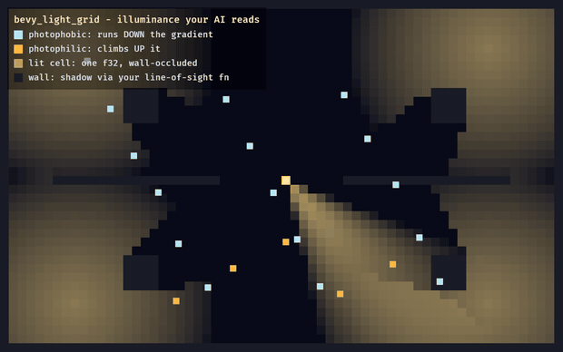

# bevy_light_grid

> ⚠️ **Vibe Coded** — written by an AI agent working from a human's direction. It is used in a shipping game and covered by tests, but it has had no line-by-line human audit. Read it before you trust it.

An illuminance grid your **creatures** can read: a CPU scalar field over cells that answers "how bright is it here, and which way is brighter".



That is `examples/beam.rs`. Every lit cell is one `f32` this crate computed on the CPU, drawn flat so you can look at the number rather than at a lighting pass. The pale dots and the amber dots run **identical code** against **the same field** — the only difference between fleeing and chasing is the sign of one argument to `light_push_at`. Watch a pale dot reach shadow and stop: the gradient there is flat, so an unlit creature is left unbiased instead of shoved somewhere arbitrary. Then the beam rotates off its hiding place and it runs again.

> **This repo is a read-only mirror.** It is split out of [`Ladvien/foundation_vs_slop`](https://github.com/Ladvien/foundation_vs_slop) with `git subtree split`, history intact. Issues and PRs belong upstream.

## This is not a renderer

That distinction is the whole point. Your GPU lighting pass already knows how bright every pixel is — but the answer lives in a framebuffer, and a crab deciding whether to scuttle into shadow cannot read a framebuffer. This crate computes the same question on the CPU, at cell resolution, in a form gameplay can sample and differentiate.

```rust
use bevy_light_grid::{LightGrid, FlashlightCone, light_push_at};

let mut field = LightGrid::new(width, height, floor_cells());

// Static: expensive, event-driven. Walls cast shadow via YOUR occlusion test.
field.bake(&fixtures, |a, b| map.line_of_sight(a, b));

// Dynamic: cheap, every tick. Only the moving cones are re-added on the cached base.
field.compose(&cones, |a, b| map.line_of_sight(a, b));

let brightness = field.sample_cell(cell);
let flee = light_push_at(&field, cell, -gain);   // photophobic: descend toward the dark
```

Three marker components come with it — `Photophobic`, `Photophilic`, `Phototropic` — plus `phototropic_scale` for things that grow toward light rather than walk toward it.

## Two layers, for a reason

The **base** bake is `O(fixtures × range²)` and runs only when a fixture changes. The **compose** pass copies that cached base and adds just the moving cones, so a walking flashlight's beam sweeps live for a fraction of the cost. Splitting them is what makes a per-tick lighting field affordable at all.

## Occlusion is yours

`bake` and `compose` take a `los` closure. "Can this cell see that one" is a question about your map — tiles, portals, a BVH, whatever you have — and a lighting crate that answered it would be guessing. The closure is monomorphised at the call site, so it costs nothing over an inlined method.

## Determinism

Both passes accumulate with a non-associative `+=`, so **sort `fixtures` and `cones` by source cell before calling**. The crate sees a slice, not the query that produced it, so it cannot do this for you — and an unsorted batch is the classic way a "deterministic" simulation quietly stops being one.

Rock cells hold exactly 0.0 forever (both writers gate on the floor mask), so the hot per-tick scans visit only floor cells — bit-identical to a full-grid pass, not an approximation. `cells()` exposes the full grid so you can fold that invariant into your own hash.

## References

- Majercik et al., *Dynamic Diffuse Global Illumination*, JCGT 2019 — visibility-based leak suppression
- Björk & Michelsen, FDG 2014 — the flashlight cone as a vision/deterrent field
- Nakagaki et al., PRL 2007 — Physarum photoavoidance (the taxis this field supports)
- Zhang et al., PLoS ONE 10:e0123025 (2015) — light-gated fungal fruiting
- Chilimbi, Hill & Larus, *Cache-Conscious Structure Layout*, PLDI 1999 — restricting hot scans

## Examples

```sh
cargo run -p bevy_light_grid --example shadow  # terminal: bake + compose, occlusion behind pillars
cargo run -p bevy_light_grid --example taxis   # terminal: photophobic / philic / tropic, side by side
cargo run -p bevy_light_grid --example beam    # the gif above. Needs a GPU.
```

`shadow` and `taxis` print the field as ASCII — no window, no GPU, so they run anywhere. `shadow` supplies a Bresenham line-of-sight closure and sweeps a flashlight cone over a cached static bake. `taxis` releases a photophobic walker into the light and prints it descending the gradient, then eases a phototropic body toward a lamp under its per-tick rate cap.

`beam` is the same three ideas on screen at once, with a legend: the static bake, the moving wedge composed on top of it every frame, and sixteen photophobic plus five photophilic creatures steering on nothing but `light_push_at`. It is the only example here that opens a window, and it is a **dev-dependency** that gives it one — the crate itself still takes `bevy_math` and `bevy_ecs` and nothing that draws, which `tests/leaf.rs` enforces by reading `[dependencies]` only.

## License

MIT OR Apache-2.0, at your option.
