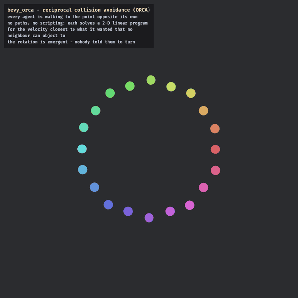

# bevy_orca

> ⚠️ **Vibe Coded** — written by an AI agent working from a human's direction. It is used in a shipping game and covered by tests, but it has had no line-by-line human audit. Read it before you trust it.

Optimal Reciprocal Collision Avoidance (ORCA) as a plain library: the 2-D linear program, over discs, on `bevy_math`'s `Vec2`. No ECS, no plugin, no schedule — you call a function and get a velocity back.

> **This repo is a read-only mirror.** It is split out of [`Ladvien/foundation_vs_slop`](https://github.com/Ladvien/foundation_vs_slop) with `git subtree split`, history intact. Issues and PRs belong upstream.



That is `examples/circle_swap.rs`: every agent walking to the point directly opposite its own, so all of them want the exact centre at the same moment. **The rotation is not scripted.** Nobody is told to turn, there is no path planner and no flow field — each agent solves a small linear program for the velocity closest to what it wanted that no neighbour can object to, and the vortex is what falls out when twenty of them do that simultaneously.

## What it does

Given an agent's *preferred* velocity — whatever your global navigator wants, a flow field or a path follower — ORCA returns the collision-free velocity **closest** to it, assuming every neighbour is reasoning the same way and each side takes half the avoidance.

That reciprocity is the whole point. Summed-force separation makes two agents on a head-on course shove equally and net zero, so they freeze or oscillate; under ORCA each steps aside by half.

```rust
use bevy_math::Vec2;
use bevy_orca::{Agent, new_velocity};

let me = Agent { pos: Vec2::new(-1.0, 0.0), vel: Vec2::X, radius: 0.5, avoids: true };
let them = Agent { pos: Vec2::new(1.0, 0.0), vel: -Vec2::X, radius: 0.5, avoids: true };

let v = new_velocity(
    &me,
    Vec2::X,          // preferred velocity
    &[them],          // neighbours
    &[],              // wall half-planes: (unit normal toward the wall, max approach speed)
    2.0,              // time horizon, seconds
    1.0 / 60.0,       // dt
    1.5,              // max speed
);
```

`avoids` is whether that neighbour is *also* running avoidance. When it is, the pair splits the avoidance 50/50; when it is not — an idle agent holding ground — the mover takes the **full** avoidance, so a stationary agent is not assumed to step aside and then walked through.

## Scope

Agent↔agent only. Static geometry enters just as the optional `walls` half-planes, each a unit vector toward a solid cell plus the speed at which the agent may still close on it this step: the agent can slide along or coast up to contact, but never accelerate *through*. Final contact resolution is yours.

## Determinism

Pure arithmetic, no allocation beyond the line list, no RNG, no interior mutability. Identical inputs give bit-identical outputs, which is why the parent project can hash its simulation state.

`bevy_math` is taken with `default-features = false, features = ["nostd-libm"]`, matching Bevy's own internal selection: the defaults would enable `glam/std` and swap glam's transcendentals from libm to std's, which is a behaviour change for anyone hashing transforms downstream.

## Examples

```sh
cargo run -p bevy_orca --example head_on        # terminal: reciprocity, each side takes half
cargo run -p bevy_orca --example wall_corridor  # terminal: walls hard, neighbours soft
cargo run -p bevy_orca --example circle_swap    # the gif above. Needs a GPU.
```

`head_on` and `wall_corridor` print to the terminal — no window, no GPU, nothing to install. `head_on` walks two agents into each other and prints the lateral offset each takes, then repeats it with the neighbour holding ground so you can see the mover absorb the whole avoidance. `wall_corridor` adds wall half-planes and reports the deepest penetration, which stays at zero.

`circle_swap` is the picture. Two things in it are worth knowing before you tune this in your own game, because both were found by watching it fail:

- **Perfect symmetry deadlocks.** Identical agents, evenly spaced, all aimed at one point give the linear program no reason to prefer left over right, and the ring simply stalls. RVO2's own circle demo perturbs the preferred velocity for this reason; the example does it deterministically.
- **Too much lookahead stalls it too, and less obviously.** At a 3-second horizon the pack braked for a congestion that had not happened yet and thereby caused it: velocity decayed geometrically — 0.80, 0.57, 0.41, 0.29, 0.21 — while the crossing ground to a halt a ring-radius in. At 1.5 they commit, and the shear resolves it. If your crowd is mysteriously slow, this dial is the first suspect.

## License

MIT OR Apache-2.0, at your option. Derived from RVO2 (Apache-2.0) — see [`NOTICE`](NOTICE).
