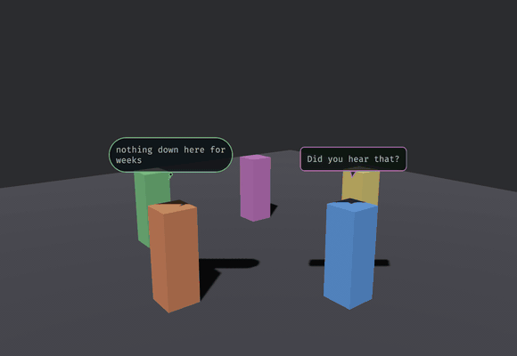

# bevy_speech_bubbles

> ⚠️ **Vibe Coded** — written by an AI agent working from a human's direction. It is used in a shipping game and covered by tests, but it has had no line-by-line human audit. Read it before you trust it.

World-space speech and thought balloons: text rasterized on the CPU into an `Image`, put on a billboarded quad, anchored above an owner entity and turned to face a camera you name.



That is `examples/chatter.rs`. The balloons are **quads in the scene**, not a UI layer — which is the whole difference, and the orbit is what shows it: they hold a world position above their owner, they can be occluded, and they turn because `track_bubbles` turns them. A screen-space overlay gives you none of that, and `Text2d` would want a 2D camera this scene does not have.

Two shapes carry the channel — a tailed balloon for what is said aloud, a soft pill with a dot-tail for what is only thought — and the border tint carries the affect. Dwell time is not a constant either: `dwell_secs` scales with how much there is to read, so long lines linger and short ones snap away.

> **This repo is a read-only mirror.** It is split out of [`Ladvien/foundation_vs_slop`](https://github.com/Ladvien/foundation_vs_slop) with `git subtree split`, history intact. Issues and PRs belong upstream.

## In the world, not on the screen

No 2D camera, no UI layer, no screen-space overlay. The balloon is a quad in the scene — it occludes and is occluded like anything else, and it moves with the thing that said it.

```rust
// Load the font from wherever YOUR assets live, and insert the resource.
commands.insert_resource(BubbleAssets {
    quad: meshes.add(Rectangle::new(1.0, 1.0)),
    font: FontArc::try_from_vec(std::fs::read("assets/fonts/Something.ttf")?)?,
});

let face = build_bubble(&assets, &mut images, &mut materials, &style, "Contact, west corridor.");

app.add_systems(Update, (
    track_bubbles::<MyMainCamera>,   // anchor, billboard, mirror visibility, despawn orphans
    expire_bubbles,                  // ambient bubbles time out
));
```

Two shapes are drawn: a rounded rect with a pointed tail for `BubbleKind::Speech`, and a soft pill with a trailing dot-tail for `BubbleKind::Thought`. `Emotion` tints the border — balloon colour reliably conveys affect (An et al., *AniBalloons*, arXiv:2408.06294).

## Name your camera — this one is load-bearing

`track_bubbles` is generic over a camera **marker component**, and that is a deliberate safety property rather than flexibility for its own sake.

Bevy's `Single<..>` silently *skips* its system when the query does not match exactly one entity. A tracking system filtered on `With<Camera3d>` therefore works perfectly right up until something spawns a second 3D camera — a render-to-texture pass, a portal, a minimap — at which point every bubble quietly stops tracking and nothing anywhere reports an error.

Being generic makes it impossible for this crate to write that filter for you. You have to name a marker you control, which is the only version that stays correct.

## The font is yours to load

`BubbleAssets` holds a quad mesh and a `FontArc`, and this crate never reads a file. A library that hardcoded `assets/fonts/…` would be hardcoding your project layout — so you build the resource and insert it. The crate contains no filesystem access and no panic path.

## Why the text is rasterized here

Bevy 0.19's text stack has no public "rasterize this string into a standalone `Image`" API, and a world-space balloon has no 2D camera to host a `Text2d`. So glyphs go through `ab_glyph` into an RGBA buffer — once per line, not per frame — and the buffer becomes a texture.

## Cosmetic by construction

Both systems belong on `Update`. `expire_bubbles` reads `Time<Real>` rather than virtual time, so bubbles still expire while the simulation is paused — a modal conversation that zeroed virtual time would otherwise freeze its own dialogue on screen forever.

## Examples

```sh
cargo run -p bevy_speech_bubbles --example two_balloons -- /System/Library/Fonts/Supplemental/Arial.ttf
cargo run -p bevy_speech_bubbles --example chatter      -- /System/Library/Fonts/Supplemental/Arial.ttf
```

`two_balloons` is the smallest thing that works: one speech balloon and one thought balloon over two cubes, camera orbiting so you can see them billboard and occlude.

`chatter` is the gif above — five speakers taking turns, both shapes, all seven emotion tints, balloons expiring on their own dwell. It is also the example to read if you are wiring this up, because it shows the one thing that trips people: `BUBBLE_ANCHOR_Y` is measured from the **owner's own translation**, so the crate assumes an origin at the feet. Anchor a balloon to an entity centred on its body and every balloon floats an extra half-height up, tail pointing at nothing.

Both need a GPU, and both take the font path as a required argument rather than defaulting it — the same reason the crate takes a `FontArc` instead of a path: guessing where your assets live is the assumption a library must not make.

## License

MIT OR Apache-2.0, at your option.
