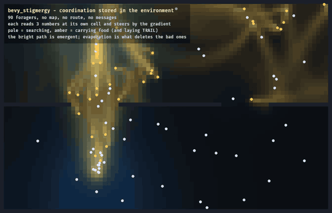

# bevy_stigmergy

> ⚠️ **Vibe Coded** — written by an AI agent working from a human's direction. It is used in a shipping game and covered by tests, but it has had no line-by-line human audit. Read it before you trust it.

Stigmergic influence fields over a fixed cell grid: `N` scalar channels that agents deposit into, which evaporate, diffuse between floor cells, and can be sampled or climbed — plus a vectorial rally pheromone for tracking a moving target.

> **This repo is a read-only mirror.** It is split out of [`Ladvien/foundation_vs_slop`](https://github.com/Ladvien/foundation_vs_slop) with `git subtree split`, history intact. Issues and PRs belong upstream.



That is `examples/foraging.rs`. Ninety foragers, a nest, a food source, and a wall with two gaps. **No agent has a map, a route, or any idea where the gaps are** — each reads three numbers at the cell it is standing on and steers by the gradient. The bright path is emergent, and the dim ones fading beside it are the point: evaporation is how the colony forgets a route that stopped paying.

## The idea

Stigmergy is coordination *through the environment*. Agents write into a shared field and read it back, so a crowd converges on a trail, disperses from a threat, or recruits toward an alarm without anybody negotiating — the field is computed once and shared by all of them, and the group behaviour falls out.

```rust
use bevy_math::IVec2;
use bevy_stigmergy::{ChannelDef, StigGrid};

const SCENT: usize = 0;
const THREAT: usize = 1;

let mut field = StigGrid::<2>::new(width, height, floor_cells(), [
    ChannelDef { evaporate: 0.4, diffuse: 0.10, deposit_radius: 1.5 },  // SCENT
    ChannelDef { evaporate: 1.2, diffuse: 0.05, deposit_radius: 3.0 },  // THREAT
]);

field.deposit(SCENT, cell, 1.0);        // placement
field.evaporate_diffuse(dt);            // decay + spread, once a tick
let here = field.sample_cell(SCENT, c); // query
let uphill = field.gradient_cell(SCENT, c);
```

## What it deliberately does not do

**It owns no resources, registers no systems, and has no schedule.** When deposits drain, when evaporation runs, and where both sit relative to the agents reading the field are gameplay decisions. A crate that made them would be unusable in any game that wanted different ones.

**It does not name your channels.** A channel table is game content. Channels are `usize` indices and `N` is yours to pick, so "what does channel 3 mean" stays a question about your game.

**It works in cell space, not world space.** Every entry point takes an `IVec2` cell. If you already own a world↔cell mapping, this crate keeping a second copy of it would only give the two a chance to drift.

## Two gotchas worth knowing

- **A deposit masks its destination, not its path.** The kernel is a Euclidean disc that skips non-floor cells — not a flood fill and not a line-of-sight test — so a radius wide enough to span a wall still reaches the floor beyond it. That is deliberate (a smell or a sound goes round a corner). *Diffusion* is the pass that respects walls.
- **Deposits accumulate with a non-associative `+=`.** If you produce them from an unordered source (an ECS query, a hash map), sort the batch before submitting or your field is not reproducible. This crate never sees the batch, only individual deposits, so it cannot do it for you.

## Determinism

Written to be bit-reproducible, because a simulation that hashes its state cannot afford otherwise: the neighbour sum keeps a fixed E/W/S/N order (float addition is non-associative); the diffusion is a pure stencil over disjoint output slots, so its result is identical at any thread count — which is what makes the `rayon` pass safe; and skipping rock cells is exact rather than approximate. `channels()` and `cells()` expose the **full** grids so you can fold the rock-cells-stay-zero invariant into your own fingerprint.

## References

- Holland & Melhuish, *Stigmergy, self-organization, and sorting in collective robotics* (1999)
- Tang, Liu & Pan, ACO review, IEEE/CAA JAS (2021) — deposit, evaporation, positive feedback
- Lewis, *Escaping the Grid*, Game AI Pro 2 Ch.29 — placement / diffusion / query
- Mark, *Modular Tactical Influence Maps*, Game AI Pro 2 Ch.30
- Tang et al., *Dynamic target searching and tracking with swarm robots based on stigmergy*, Robotics & Autonomous Systems (2019) — the vectorial pheromone
- Dourvas, Sirakoulis & Adamatzky, IEEE Access (2019) — parallelising the diffusion stencil

## Examples

```sh
cargo run -p bevy_stigmergy --example trail     # terminal: a scent trail spreads, fades, respects walls
cargo run -p bevy_stigmergy --example rally     # terminal: the vectorial pheromone tracking a target
cargo run -p bevy_stigmergy --example foraging  # the gif above. Needs a GPU.
```

`trail` and `rally` render the field as ASCII — no window, no GPU. `trail` lays a channel along a walked path across a map with a wall and a single gap, so you can watch diffusion go through the gap and not through the wall. `rally` has three fixed scouts marking a target that keeps moving, then stops marking so you can see the recruitment expire itself.

`foraging` is three channels at once — a HOME beacon, a FOOD beacon, and a TRAIL that only laden foragers lay — and it is the example to read if you are tuning this into a game, because the single hardest thing here is picking weights that are in scale with each other. Measured in that example, a beacon gradient averages about `0.09` per cell. The first wander term tried was `2.2`, which is *larger than the homing signal it competes with*, so laden foragers wandered the whole map laying trail everywhere and the "path" was an undifferentiated wash. Steering weights have to be set against `weight * |gradient|`, not by taste — and the way to find out is to print the gradient magnitudes rather than squint at the picture.

## License

MIT OR Apache-2.0, at your option.
