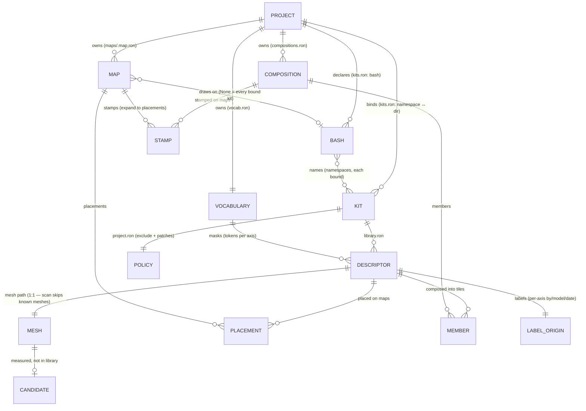

# emerge-mapper — notes for agents

A standalone world-building editor: open a project directory, author a map from an asset library, save something any engine can load. A Bevy application in its own right, not a mode of a game.

## Source of truth

The source of truth for this crate is [`Ladvien/foundation_vs_slop`](https://github.com/Ladvien/foundation_vs_slop) at `crates/emerge-mapper/`. If you are reading this in a standalone `Ladvien/emerge-mapper` checkout, that is a read-only `git subtree split` mirror — **changes made here cannot be pulled back**. Make them upstream.

## Build, run, test

**Not a leaf.** It path-depends on the siblings `emerge-core`, `emerge-bevy`, `emerge-anim` and `bevy_devshot`, so it builds *inside* the workspace:

```sh
cargo run -p emerge-mapper
cargo test -p emerge-mapper      # includes tests/headless.rs — no GPU, no window
```

## The non-negotiable: never take over a real keyboard or display

Two sanctioned ways to exercise this editor exist, and neither of them touches the machine's actual input devices. Reaching for a `macinput`-style tool that types into the focused window is out — it seizes a machine somebody may be using, and it is the thing both mechanisms below were built to replace.

**For wiring, go headless.** `harness::build_headless` (`src/harness.rs:80`) builds the same plugin graph with `WgpuSettings { backends: None }` and no window, so `tests/headless.rs` can step frames and assert. The lib/bin split (`src/lib.rs` + `src/main.rs`) exists **for exactly this**: before it there was nothing to link against, so the only way to learn whether a system was registered — or whether a `Res<T>` it takes exists — was to run the editor and look at it.

That matters more here than usual: in Bevy 0.19 a missing `Res<T>` **panics its system** rather than skipping it, and no unit test can answer "does this app survive its first frame". The arithmetic is unit-tested where it lives (`descriptor::pick_cell`, `view::pan_direction`, `keys::repeating`); what those tests cannot see is the schedule.

**Tests do not read the shipped assets.** `tests/fixtures/mod.rs` writes the project a test is
about — a vocabulary, a library, a map, compositions, and minimal binary glTFs built in memory — into
a temp directory. The shipped `assets/` is corpus, and a suite bound to it fails the day somebody
imports a kit, which is the thing this editor exists to do. The **font** is the one borrowed file:
`install_font` cannot boot without one and `Font::from_bytes` rejects a made-up file.

The deliberate exception is an **asset-contract** test — one whose assertion *is* a fact about what
ships ("does the shipped valkyrie still measure the way `rigs.ron` claims", "does the site kit still
open"). Those read the real project and say so in their doc comment; checking them against a fixture
would be checking that the fixture is what the fixture is. Anything else belongs on `Fixture`.

**For a measured frame, use the sentinel files.** `src/devshot.rs` reads `drive.request` — whitespace-separated verbs (`tiles`, `map`, `anim`, `compose`, `arm`, `stamp`, `down`, `up`) applied through the same resources the key handlers write — and `bevy_devshot` reads `screenshot.request` beside it. Together those let a capture script reproduce an author's exact steps in a real window without a person at the keyboard. That path is not a convenience: three Site editor bugs were invisible to a green test suite and visible only in a measured frame.

**For an agent driving the editor, there is now BRP.** `cargo run -p emerge-mapper --features debugger` adds `bevy_debugger_bevy::DebuggerPlugin` and the HTTP transport, and points the capture at `src/surface.rs`'s image — the same one the window shows, so `bevy_debugger/input` writes into the editor's input message stream — which Bevy folds into `ButtonInput` — and `bevy_debugger/screenshot` captures offscreen with a region and a zoom.

**An agent can type into a field, and that is new.** Every text handler here reads `MessageReader<KeyboardInput>` and matches `logical_key`, so while injection wrote only `ButtonInput` none of them were reachable — not the characters, and not `Enter` or `Escape` either. `{"kind":"Keyboard","text":"porch_a"}` is now one call and one frame, and `{"kind":"Keyboard","key":"Escape"}` reaches both the dispatcher and the open field, the way a real Escape does. One caveat that is a property of this crate rather than the debugger: **text sent in the same frame as the key that opens a field is held back one frame on purpose**, because every field here drains the stream while shut so the opening keystroke cannot become its first character (the `xseam` bug, `keys.rs`).

**The mouse half only works because of `view::Pointer`.** An injected cursor lands in a `DebugCursor` resource, never in the window's own cursor — writing that would make Bevy move the *physical* mouse. So `sense_pointer` reads the pointer once a frame in `keys::Phase::Sense` and every spatial system reads `Pointer` rather than the `Window`. **A new system that calls `Window::cursor_position` directly is undrivable by an agent, and is a second definition of where the cursor is** — that is what `cursor_ground` taking a position rather than a `Window` is for. That is what the sentinel driver's verb list was a hand-built stand-in for. The port is `BEVY_BRP_PORT`, shared with the MCP server's own config; it defaults to the same 15702 the game uses, so running both at once means setting it.

`harness::add_debugger_plugins` is deliberately **not** part of `add_editor_plugins` and **not** in `build_headless`: a test process builds several `App`s and the second would fail to bind. The two entry points still share one plugin graph; this is an addition to the binary's, not a conditional inside the shared list.

**The mirror sees the panels now, and that is new as of 2026-08-18.** It could not, for a structural reason: Bevy draws a UI tree to **one** camera, so an offscreen mirror of the world never received the interface — measured the same day, same screen, same second, the BRP capture returned one chair on black while the whole-frame capture returned the panel, the strip and the list. In an editor the interface is most of what there is to look at, so every visual question fell back to `bevy_devshot`, which reads the **window surface** and therefore needed the window in front — taking the display of whoever was at the machine.

`src/surface.rs` closes that: **the whole application draws into one `Image`** — the world, then the interface on top — and the window shows that image. `bevy_debugger/screenshot` reads the same handle, so an agent gets what the author is looking at, with `region` and `zoom`, and **nobody's screen is taken**. Three things there are load-bearing and each broke once on the way in, so they are pinned by `the_application_draws_into_one_surface_an_agent_can_read`:

- **The surface is built in `SurfacePlugin::build`, not in `Startup`.** `bevy_state` inserts its transition schedule *before* the startup ones (`insert_startup_before(PreStartup, StateTransition)`, `bevy_state-0.19.0/src/app.rs:336`), so `OnEnter(Editor)` runs first and `view::setup` panicked on a missing `Res<Surface>` — eighty tests, one message.
- **Its cameras are excluded from the scene teardown**, and the rule that decides what a screen owns is written **once**, in `screen::scene_roots`. It used to be written twice; the second copy (`chooser::tear_down_menu`) swept the rig away and left the editor with no camera for its interface, seventy-six UI nodes computing a target of nothing, and **nothing in the log**.
- **The pointer is re-pointed at the surface** (`surface::retarget_pointer`), because `bevy_ui`'s picking backend keeps a pointer only for cameras whose render target equals the pointer's own (`picking_backend.rs:129`). Without it every panel's `Hovered` reads false and a click on a row falls through to the map behind it.

**`bevy_devshot` stays**, and is still the player-facing Ctrl+P path, but it is no longer the only way to see a panel.

**And an agent can now guide the author instead of guessing.** That gap is what the mirror's blindness costs in practice: an agent that cannot see a panel has to ask the person what it says, and on 2026-08-12 that loop produced five bug reports in one afternoon of which three were not reproduced first time. `bevy_debugger/guide` posts a script; the editor renders one step over the map; `bevy_debugger/guide+watch` waits on a named condition and records `k/n` per step.

`src/guided.rs` is the editor's half — its checkpoint vocabulary, registered by the names an author would use (*"the tile has two pieces"*, *"the tile is saved"*), each a one-shot system answering `bool`. A checkpoint asks **"has the state the step wanted arrived?"**, never "did they press the right key": a script that watched keystrokes would be testing the author, and the exercise exists to test the editor.

`GuidePlugin` is in the **shared** plugin list while `add_debugger_plugins` is not, and the difference is that it binds nothing. The harness is where it is most wanted: `every_checkpoint_a_shipped_guide_names_is_registered_and_runs` boots this editor headless and asserts that every condition named by a file under `guides/` exists **and runs** — a one-shot system is in no schedule, so nothing else in the suite would ever discover that one of them takes a `Res<T>` that does not exist, which in Bevy 0.19 is a panic. A stranded exercise is caught in CI instead of at step four with the author at the keyboard.

Scripts live in `guides/` as JSON, not as constants in the source: an agent posts them over BRP, and an editor that also shipped a "start the tour" key would be a second way to load one.

**A card is an ordinary `bevy_debugger/screenshot` now** — the overlay is a UI panel, and since 2026-08-18 the interface is drawn into the same image the capture reads (`src/surface.rs`), so no window has to be in front. `scripts/guide_devshot.sh` remains for the whole-frame player-facing path only; it builds the editor, posts a guide, and captures whole frames per requested step. It **waits for you to click the window and will not raise it**: on macOS 26.5 the documented `osascript ... set frontmost of (first process whose unix id is $PID)` is accepted and does nothing, and a freshly launched window does not come up in front either. A black frame here is exactly 55,654 bytes, which the script checks for rather than handing you the file.

**One plugin list, two entry points.** `main.rs` and `harness::build_headless` share it — "not a second code path", the same argument the parent repo's `sim_harness.rs` makes.

**Borrowed, not copied.** The editor spawns through `emerge_bevy::spawn_descriptor`, previews rigs through the real `emerge-anim` blender, and captures through `bevy_devshot` — never a local copy of any of them. A map that looked one way here and another in the game would be the whole failure this design exists to prevent.

## Rules

- **Bevy 0.19 is pinned.** Read the vendored source (`~/.cargo/registry/src/index.crates.io-*/bevy-0.19.0/`, and its `examples/`), not bevy.org — that documents `main` and has been wrong for this pin more than once.
- Consult Bevy documentation often. It can be found at codex_fs/offline_reference_docs/bevy-0.19-book/
- **A missing `Res<T>` panics its system**; take `Option<Res<T>>` or `init_resource` it. **All run conditions are evaluated** — a bare `Res<T>` inside a `.run_if(..)` closure panics even behind an earlier condition that returned false.
- **`Single<..>` silently skips its system on a non-unique match**, so any second camera breaks every `Single<.., With<Camera3d>>`. Filter positively on a named marker.
- **No `unwrap()`.** Everything here is user input or a file on disk.
- **One path per feature.** No fallbacks, no legacy shims, no stub placeholders. Staged edits go through the commit door; nothing writes a degraded result behind it.
## Data model

**A project is implicit — it is just a directory.** Nothing on disk declares "this is a project"; the shape `assets/emerge/` *is* it. The project owns the vocabulary, the kit bindings, the compositions, and the maps. The menu can create kits and maps but nothing can create the root that holds them — that is the gap a "new project" verb would fill (write `assets/emerge/` with `vocab.ron`, `kits.ron` with an empty bind and no authoring, and `maps/`; then `+ new kit` / `+ new map` take over).

The relationships, as an ERD. **This is also the order the menu's columns are drawn in** — PROJECT
is the root so it is leftmost, and between its two children the cross-edge decides: a MAP names a
BASH, a BASH names KITs, and the build chain runs KIT → DESCRIPTOR → PLACEMENT → MAP. So the screen
reads `PROJECTS | KITS | MAPS`, left to right; `left`/`right` cross those columns one press each and
`up`/`down` walk down the one you are in, through the panels stacked under its list
(`chooser.rs` `spawn_screen`, `Focus::COLUMNS`). Arrows only — there is no `Tab`, the same rule the
Meshes and Compose tabs already follow.



Four facts that trip people up:

- **Kit ≠ mesh folder.** A kit is a *bound* directory (`kits.ron` maps namespace ↔ dir) holding `library.ron` (descriptors) + `project.ron`. The raw GLB packs under `assets/` are just meshes — they become **candidates** when scanned and **descriptors** when imported. One mesh → one descriptor: `emerge_core::import::scan` skips any mesh the library already has, so a candidate and a library entry can never name the same file (`tiles.rs:3238`).
- **Compositions and maps are project-level, not per-kit.** A tile can seat two kits' pieces, so it cannot live in either kit; a map resolves against the merged library. Both hang off Project, not Kit (`chooser.rs` "The maps are the project's, not a kit's").
- **Labels are two things.** The durable `LabelOrigin` record on each descriptor (who wrote each axis, which model, when — `descriptor.rs:123`), and the ephemeral suggestion cache at `target/vlm_suggestions.ron` (gitignored) that stages model answers before apply (`labels.rs:39`). The cache is keyed by id for library entries, mesh path for candidates — never an index.
- **A bash filters what is offered, never what loads.** `bound_library` merges *every* bound kit whatever a map says, so a placement can never be stranded and a composition may still cross kits. `Map::bash` decides only what the palette offers, and `OpenMap::palette_namespaces` unions the namespaces the map already uses back in — which is why naming one cannot break a map. A bash is hand-authored in `kits.ron`; `B` on a map row only picks between the ones declared there.

### UI surfaces

How each entity is reached, refined and linked in the editor today. Each step of the alignment work
updates its own row, so this table is correct after every step rather than only at the end.

| Entity | Navigate | Refine | Link | Holes |
|---|---|---|---|---|
| PROJECT | PROJECTS column (`chooser.rs` `projects_rows`) — siblings holding `assets/emerge`, current marked | create via `N` / `Enter` on `+ new project` (`create_project`: kits.ron + byte-copied vocab) | `Enter` on a non-current row reports `emerge-mapper <dir>`; the first kit made becomes the authoring kit | cannot be renamed or deleted — a refusal says to remove the tree from the file system |
| VOCABULARY | tag chips draw the table (`tiles.rs` ~8020) | `+` chip per axis row + `Shift+T` → `token_prompt` (comment-preserving `append_token`) | `toggle_tag` (`tiles.rs:5592`) | `capabilities`/`edge`/`slot` axes drawn by no UI |
| KIT | KITS column | create + delete; no rename; `A` / click sets authoring (`set_authoring`) | bound in `kits.ron`; a bash names it (`Bash::kits`) | cannot be renamed; a bash is hand-authored in `kits.ron`, with no UI that makes one |
| POLICY | POLICY panel under the kit list (`chooser.rs` `policy_rows`) | `Delete` removes exclusions and patches by ordinal, through the confirmation | n/a | a patch can be removed but not added |
| DESCRIPTOR | MESHES shelf | id, note, size, mount, 4 tag axes, subgrid | present | — |
| MESH | NOT IMPORTED shelf | — | import; path shown in the detail pane (`tiles.rs` mesh row) | — |
| LABEL_ORIGIN | detail pane `labels` row — model/hand + date (`tiles.rs`) | implicit | — | — |
| COMPOSITION | Compose tab | create/save (`project.rs:497`); no delete/rename | members on Tiles tab | cannot be deleted or renamed |
| PLACEMENT / STAMP | Map tab | present | `send_to_tiles` back-nav (`editor.rs:6763`) | — |
| MAP | MAPS column | Name/Bounds/Origin/Note | `B` on the row cycles `Map::bash` through the project's declared bashes (`cycle_bash` → `write_bash`); MAP INFO's `bash` row shows it | a bash cannot be created or edited from the editor |

## In the monorepo

Not a dependency of the game — it is its own binary, and the game reads what it writes via `src/emerge_map.rs`. Design docs live in `docs/2026-08-0*-emerge-mapper-*.md`; those, the root `CLAUDE.md`, and `TESTING.md` are not part of this mirror.
